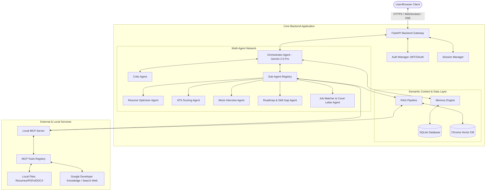

# 🚀 CareerPilot AI — Autonomous Multi-Agent Career Co-Pilot

[](https://www.python.org/)
[](LICENSE)
[](https://fastapi.tiangolo.com/)
[](https://www.docker.com/)

**CareerPilot AI** is an autonomous multi-agent career co-pilot designed to automate and optimize the career advancement lifecycle. Built using the **Google Agent Development Kit (ADK)** and the **Model Context Protocol (MCP)**, the platform coordinates a network of specialized agents to assist you with resume optimization, ATS matching, mock interviewing, skills roadmap development, and job application tracking.

The system features real-time retrieval-augmented generation (RAG), persistent episodic and semantic memory, and a dual REST/WebSocket FastAPI backend to power a glassmorphic single-page frontend dashboard.

---

## 🎨 Features & Capabilities

- **🤖 Central Orchestrator-Critic**: A routing mechanism that determines user intent, loads appropriate sub-agents, and runs responses through an independent safety/quality check.
- **📄 Resume Hub**: Drag & drop resume parser (PDF/DOCX/Markdown) that extracts key skills and maps them to a database of profiles.
- **🎯 ATS Score Optimizer**: Immediate analysis showing missing keywords, keyword density match, readability, and structural feedback.
- **🎤 Mock Interview Coach**: Real-time interactive interface driving behavioral and technical questions, scoring transcripts, and providing communication reviews.
- **🗺️ Learning Roadmap**: Step-by-step personalized learning paths covering your skill gaps with recommended course trackers.
- **💼 Application Kanban**: Full-featured vertical timeline to organize and manage active job applications.
- **🔮 Observability & Metrics**: Tracking token counts, latency, and API costs dynamically.

---

## 🏗️ System Architecture



---

## 📁 Repository Structure

```
careerpilot_ai/
├── config/                  # Agent settings & safety policies
├── custom_mcp/              # Custom Model Context Protocol tools & server
├── database/                # SQLite connection & database schemas
├── memory/                  # Short/Long term episodic memory
├── rag/                     # Chunker, parser, & ChromaDB vector storage
├── src/                     # Core application source
│   ├── agents/              # Google ADK agent specifications
│   ├── api/                 # FastAPI routes (chat, dashboard, auth)
│   ├── frontend/            # Single Page Application (HTML/CSS/JS)
│   └── main.py              # Application entry-point
├── tests/                   # Pytest suite (unit & integration)
├── Dockerfile               # Production container config
└── docker-compose.yml       # Orchestrates container & volumes
```

---

## 🚀 Getting Started

### 📋 Prerequisites
- **Python 3.11** or higher installed.
- **Docker** and **Docker Compose** (optional, for containerized run).
- A Google **Gemini API Key** (get one from Google AI Studio).

### 🔧 Installation & Local Setup

1. **Clone the repository:**
   ```bash
   git clone https://github.com/your-username/careerpilot_ai.git
   cd careerpilot_ai
   ```

2. **Set up a Virtual Environment:**
   ```bash
   python -m venv .venv
   # On Windows (PowerShell):
   .venv\Scripts\Activate.ps1
   # On Linux/macOS:
   source .venv/bin/activate
   ```

3. **Install Dependencies:**
   ```bash
   pip install -r requirements.txt
   ```

4. **Configure Environment Variables:**
   Create a `.env` file in the root directory based on the `.env.example`:
   ```bash
   cp .env.example .env
   ```
   Open the `.env` file and populate:
   - `GEMINI_API_KEY`: Your Gemini API key.
   - `JWT_SECRET`: A secure random secret key for session signatures (e.g. run `openssl rand -hex 32` to generate one).

---

## ⚡ Running the Application

### Option A: Local Development Server
To launch the FastAPI application and serve the frontend locally:
```bash
python src/main.py
```
Or run uvicorn directly:
```bash
uvicorn src.main:app --reload --port 8000
```
Open **[http://localhost:8000](http://localhost:8000)** in your browser to view the interface.

### Option B: Running with Docker Compose
If you prefer running the app in containerized form:
1. Make sure your `.env` contains your `GEMINI_API_KEY` and `JWT_SECRET`.
2. Start the service:
   ```bash
   docker-compose up --build -d
   ```
3. The server will start up on **[http://localhost:8000](http://localhost:8000)**.
4. Logs can be viewed with:
   ```bash
   docker-compose logs -f
   ```

---

## 🧪 Running Tests
The project features a comprehensive unit and integration testing suite covering the database schemas, memory consolidating engine, custom MCP tools, and RAG pipeline.

To execute tests with pytest:
```bash
pytest
```
Or to run via venv interpreter:
```bash
.venv\Scripts\python -m pytest
```

---

## 🔒 Security & Safety Policies
CareerPilot AI implements:
1. **Input Sanitization**: Sandboxed parsing of PDF and DOCX documents with size limits (10MB).
2. **Path Access Controls**: Agent tool execution restricted exclusively to the `careerpilot_ai` project root directory.
3. **Critic Agent Loop**: Every answer is reviewed by a critic to prevent prompt injections, compliance issues, or system prompt leaks.

---

## 📄 License
This project is licensed under the MIT License. See [LICENSE](LICENSE) for details.
