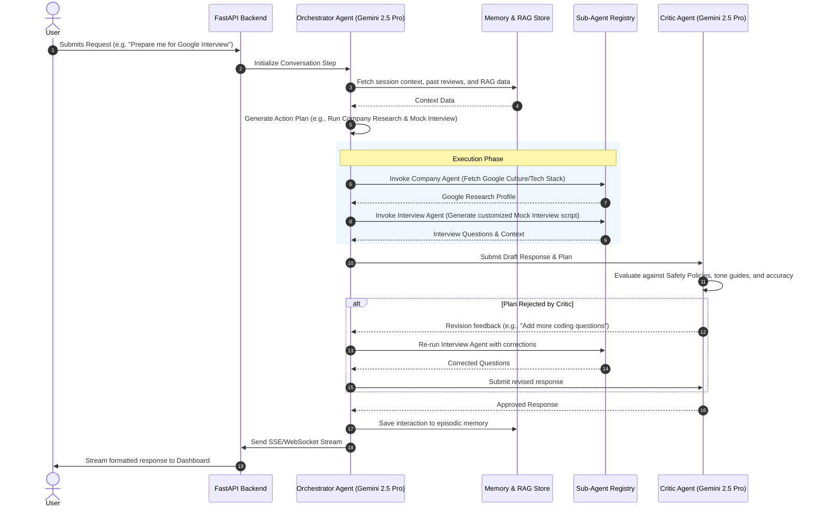
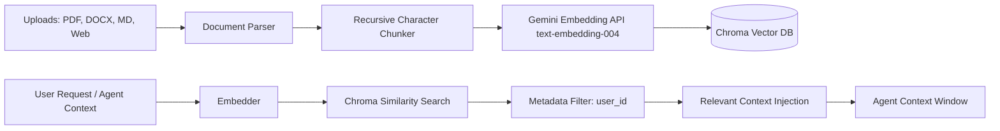

# System Architecture & Implementation Plan: CareerPilot AI

This document establishes the production-grade, enterprise-ready architectural specification for **CareerPilot AI**, an autonomous multi-agent career co-pilot. This design is optimized for the **Kaggle AI Agents Capstone**, demonstrating industry-standard design patterns, modular agent orchestration, rigorous security controls, and robust observability.

---

## 1. Executive Summary & Design Philosophy
CareerPilot AI is designed to automate and optimize the career advancement lifecycle. By pairing the **Google Agent Development Kit (ADK)** with the **Model Context Protocol (MCP)**, the platform coordinates a network of fourteen specialized agents. The system utilizes real-time retrieval-augmented generation (RAG), long-term persistent memory, and a dual REST/WebSocket backend to deliver glassmorphic frontend dashboards.

### Core Design Principles
* **Modularity (Decomposition)**: Every agent, tool, database adapter, and UI view is loosely coupled and independently testable.
* **Safety First (Least Privilege)**: Agents operate under strict declarative safety bounds, preventing unauthorized command execution or filesystem access.
* **Observability (No Black Boxes)**: Comprehensive token, cost, latency, and tool-call metrics are tracked programmatically at every agent handoff.
* **Innovation & Competition Quality**: Incorporating a self-correcting **Orchestrator-Critic** architecture, semantic hybrid RAG, and cross-session memory consolidation.

---

## 2. Design Decision Matrix & Rationale

| Component | Selected Technology | Alternative Considered | Benefits | Trade-offs & Mitigations |
| :--- | :--- | :--- | :--- | :--- |
| **Model Stack** | **Gemini 2.5 Pro** (Orchestrator) & **Gemini 2.5 Flash** (Sub-agents) | Gemini 1.5 Series, GPT-4o | Gemini 2.5 offers superior reasoning, natively optimized tool calling, and high context windows. Configurable through `config.yaml`. | Rate limits. Mitigated by exponential backoff and localized agent usage. |
| **Primary Database** | **SQLite** | PostgreSQL, MongoDB | Single-file portability, zero-configuration local deployment, robust transactional ACID support, SQL standard compatibility. | Vertical scalability. Mitigated by using SQLAlchemy, facilitating seamless migration to PostgreSQL. |
| **Vector DB (RAG)** | **ChromaDB** (In-Process) | FAISS, Pinecone | In-process, light dependency, zero server setup required, supports rich metadata filtering (e.g. `user_id`). | In-memory query limitations. Mitigated by persistent disk backing and SQLite primary indexing. |
| **Memory Engine** | **Dual SQLite + Semantic RAG** | Redis | Zero external service dependencies, transactional durability for session logs, semantic retrieval for long-term contexts. | Latency. Mitigated by indexing and caching active session memory in-memory. |
| **API Protocol** | **FastAPI with SSE & WebSockets** | REST-only, gRPC | Supports low-latency WebSocket connections for interactive interview audio/text, and SSE for text generation streaming. | Stateful connection maintenance. Mitigated by robust ping/pong checks and fallback REST routes. |
| **Authentication** | **JWT with optional Google OAuth** | Basic Auth, Clerk/Auth0 | Complete local control over credentials, stateless validation, standard OAuth compliance. | Secret key rotations required. Mitigated by automated environment validations. |

---

## 3. Updated Architecture Diagrams

### 3.1. Unified System Architecture

```mermaid
graph TD
    Client([User/Browser Client]) <-->|HTTPS / WebSockets / SSE| API[FastAPI Backend Gateway]
    
    subgraph Core Backend Application
        API <--> Auth[Auth Manager JWT/OAuth]
        API <--> Session[Session Manager]
        API <--> Orchestrator[Orchestrator Agent - Gemini 2.5 Pro]
        
        subgraph Multi-Agent Network
            Orchestrator <--> Critic[Critic Agent]
            Orchestrator <--> SubAgents[Sub-Agent Registry]
            
            SubAgents --> ResumeAgent[Resume Optimizer Agent]
            SubAgents --> ATSAgent[ATS Scoring Agent]
            SubAgents --> InterviewAgent[Mock Interview Agent]
            SubAgents --> RoadmapAgent[Roadmap & Skill Gap Agent]
            SubAgents --> AppAgent[Job Matcher & Cover Letter Agent]
            SubAgents --> ResearchAgent[Research Agent]
            SubAgents --> SalaryAgent[Salary Predictor Agent]
            SubAgents --> LinkedinAgent[LinkedIn Optimizer Agent]
            SubAgents --> PortfolioAgent[Portfolio Review Agent]
            SubAgents --> GithubAgent[GitHub Analyst Agent]
            SubAgents --> SkillAgent[Skill Gap Analyzer]
            SubAgents --> ResourceAgent[Resource Recommender]
            SubAgents --> CompanyAgent[Company Researcher]
        end
        
        subgraph Semantic Context & Data Layer
            Orchestrator <--> Memory[Memory Engine]
            SubAgents <--> RAG[RAG Pipeline]
            
            Memory <--> DB[(SQLite Database)]
            RAG <--> VectorDB[(Chroma Vector DB)]
        end
    end

    subgraph External & Local Services
        RAG <--> MCP[Local MCP Server]
        SubAgents <--> MCP
        MCP <--> Tools[MCP Tools Registry]
        Tools <--> FileSystem[Local Files: Resumes/PDFs/DOCX]
        Tools <--> WebSearch[Google Developer Knowledge / Search Web]
    end

    classDef agent fill:#e3f2fd,stroke:#1565c0,stroke-width:2px;
    classDef database fill:#efebe9,stroke:#4e342e,stroke-width:2px;
    classDef client fill:#f1f8e9,stroke:#558b2f,stroke-width:2px;
    class Orchestrator,Critic,ResumeAgent,ATSAgent,InterviewAgent,RoadmapAgent,AppAgent,ResearchAgent,SalaryAgent,LinkedinAgent,PortfolioAgent,GithubAgent,SkillAgent,ResourceAgent,CompanyAgent agent;
    class DB,VectorDB database;
    class Client client;
```



---

## 4. Scalable Folder Structure

```
careerpilot_ai/
│
├── .env.example             # Template for API keys, DB config, and security secrets
├── .gitignore               # Excludes python cache, SQLite, and vector databases
├── README.md                # Installation and developer documentation
├── requirements.txt         # Pinned production dependencies
├── pyproject.toml           # PEP 518 project specification
├── docker-compose.yml       # Orchestrates app and instrumentation layers
├── Dockerfile               # Multi-stage production build configuration
│
├── config/                  # Configuration and security rules
│   ├── config.yaml          # Agent models, prompts, temperature, and parameters
│   └── safety_policy.json   # Declarative safety policies for agent tool executions
│
├── database/                # Relational persistence layer
│   ├── __init__.py
│   ├── connection.py        # SQLAlchemy database engine and session maker
│   ├── models.py            # SQLite schema models
│   └── migrations/          # Alembic schema migration files
│
├── rag/                     # Retrieval-Augmented Generation module
│   ├── __init__.py
│   ├── vector_store.py      # ChromaDB configuration and adapters
│   ├── embedder.py          # Gemini embedding API integration
│   └── document_parser.py   # PDF, DOCX, TXT, MD chunker and parser
│
├── memory/                  # Persistent memory subsystem
│   ├── __init__.py
│   ├── session_memory.py    # Conversation state (short-term)
│   ├── semantic_memory.py   # Long-term semantic profile consolidation
│   └── memory_manager.py    # Orchestrates episodic/semantic memory reads/writes
│
├── mcp/                     # Model Context Protocol layer
│   ├── __init__.py
│   ├── server.py            # CareerPilot custom MCP Server
│   └── tools/               # Modular tool registrations
│       ├── __init__.py
│       ├── file_tools.py    # Reading/writing PDF, DOCX, Markdown
│       ├── search_tools.py  # Web search and company analysis API wrappers
│       ├── resume_tools.py  # Skill extraction, versioning, ATS scoring
│       └── tracking_tools.py # Learning tracker and roadmap utilities
│
├── src/                     # Core application source
│   ├── __init__.py
│   ├── main.py              # CLI utility
│   │
│   ├── agents/              # Google ADK agent specifications
│   │   ├── __init__.py
│   │   ├── base_agent.py    # Abstract base class for agents
│   │   ├── orchestrator.py  # Orchestrator routing agent (Gemini 2.5 Pro)
│   │   ├── critic.py        # Safety & Quality verification agent
│   │   ├── resume_agent.py  # Resume Analysis and Versioning agent
│   │   ├── ats_agent.py     # ATS scoring and feedback agent
│   │   ├── interview_agent.py # Stateful mock interviewer agent
│   │   ├── roadmap_agent.py # Career Roadmap path generator agent
│   │   ├── app_agent.py     # Job applications and cover letter generator agent
│   │   ├── research_agent.py # Web search coordinator agent
│   │   ├── salary_agent.py  # Market salary analyzer agent
│   │   ├── linkedin_agent.py # LinkedIn profile optimization agent
│   │   ├── portfolio_agent.py # Portfolio evaluator agent
│   │   ├── github_agent.py  # GitHub profile analyser agent
│   │   ├── skill_agent.py   # Fine-grained skill gap analyzer
│   │   ├── resource_agent.py # Learning course and book recommender
│   │   └── company_agent.py # Detailed company interviewer research agent
│   │
│   ├── api/                 # FastAPI routes and middleware
│   │   ├── __init__.py
│   │   ├── auth.py          # Google OAuth, login, JWT validation
│   │   ├── chat.py          # WebSocket/SSE streaming chat routes
│   │   ├── dashboard.py     # Dashboard metrics and trackers
│   │   └── mock_data.py     # Fallback test datasets
│   │
│   ├── monitoring/          # Observability, metrics, and tracing
│   │   ├── __init__.py
│   │   ├── logger.py        # Standardized file and console logger
│   │   ├── tracer.py        # OpenTelemetry tracing setup
│   │   └── metrics.py       # Cost, token count, and latency tracking
│   │
│   └── frontend/            # Static files for the SPA UI
│       ├── index.html       # UI Shell
│       ├── styles.css       # Custom glassmorphic CSS
│       └── app.js           # Client WebSocket and SSE event handling
│
├── tests/                   # Multi-tier testing suite
│   ├── __init__.py
│   ├── conftest.py          # Shared test fixtures (in-memory SQLite, etc.)
│   ├── unit/                # Individual class and tool tests
│   ├── integration/         # API, database, and multi-agent flow tests
│   └── evaluation/          # LLM evaluation (Ragas, semantic tests)
```

---

## 5. Agent Architecture & Orchestration Flow

CareerPilot AI uses a hierarchical agent model. The Orchestrator is the central dispatcher. It determines the user's intent, retrieves relevant context from RAG and Memory, selects the appropriate sub-agent(s), and forwards the task.

### 5.1. Agent Directory & Responsibility Matrix

| Agent Name | Model Config | Scope / Responsibility |
| :--- | :--- | :--- |
| **Orchestrator** | `gemini-2.5-pro` | Decides workflows, invokes sub-agents, manages memory context, handles final consolidation. |
| **Critic** | `gemini-2.5-pro` | Independently evaluates Orchestrator plans and sub-agent outputs against constraints (accuracy, style, safety). |
| **Resume Agent** | `gemini-2.5-flash` | Reviews, structures, and refactors resume drafts. |
| **ATS Agent** | `gemini-2.5-flash` | Calculates resume scoring, identifies missing job-description keywords. |
| **Interview Agent**| `gemini-2.5-pro` | Drives stateful, dynamic mock interviews. Evaluates communication styles. |
| **Roadmap Agent** | `gemini-2.5-pro` | Synthesizes target roles and generates time-bounded, step-by-step career path structures. |
| **App Agent** | `gemini-2.5-flash` | Matches job requirements to resumes and drafts customized cover letters. |
| **Research Agent** | `gemini-2.5-flash` | Interfaces with search tools to retrieve web materials. |
| **Salary Agent** | `gemini-2.5-flash` | Extracts and estimates compensation ranges from job descriptions and web results. |
| **LinkedIn Agent** | `gemini-2.5-flash` | Reviews and recommends revisions to LinkedIn profiles for maximum visibility. |
| **Portfolio Agent** | `gemini-2.5-flash` | Validates personal websites, portfolios, and highlights gaps in project showcases. |
| **GitHub Agent** | `gemini-2.5-flash` | Assesses user's repositories, commits, and code quality using GitHub API tools. |
| **Skill Agent** | `gemini-2.5-flash` | Maps user skills to target roles, identifying hard/soft skill gaps. |
| **Resource Agent** | `gemini-2.5-flash` | Recommends tutorials, courses, and certifications based on current skill gaps. |
| **Company Agent** | `gemini-2.5-flash` | Performs company research (culture, tech stack, funding) to assist in interview prep. |

### 5.2. Orchestration Loop (Self-Correcting Plan-Execute-Criticize)



---

## 6. Database Schema Design (SQLite)

We will use SQLAlchemy to define a highly normalized schema optimized for local SQLite execution, yet structurally ready to migrate to PostgreSQL.

```mermaid
erDiagram
    users ||--o{ user_profiles : "has"
    users ||--o{ resumes : "uploads"
    users ||--o{ career_history : "records"
    users ||--o{ interview_history : "undertakes"
    users ||--o{ skill_tracking : "tracks"
    users ||--o{ roadmaps : "follows"
    users ||--o{ job_applications : "manages"
    users ||--o{ memories : "stores"
    users ||--o{ token_usage : "incurs"
    roadmaps ||--o{ roadmap_steps : "contains"
    resumes ||--o{ resume_versions : "versions"

    users {
        int id PK
        string email UNIQUE
        string hashed_password
        string full_name
        datetime created_at
        datetime updated_at
    }

    user_profiles {
        int id PK
        int user_id FK
        string target_role
        string target_industry
        string experience_level
        float target_salary
        json preferences
        datetime updated_at
    }

    resumes {
        int id PK
        int user_id FK
        string original_filename
        string file_type
        text content_raw
        text content_markdown
        json parsed_data
        float last_ats_score
        datetime created_at
    }

    resume_versions {
        int id PK
        int resume_id FK
        int version_num
        text content_markdown
        json changes_made
        datetime created_at
    }

    career_history {
        int id PK
        int user_id FK
        string company
        string role
        text description
        date start_date
        date end_date
        json skills_used
    }

    interview_history {
        int id PK
        int user_id FK
        string target_role
        datetime date_conducted
        float overall_score
        json performance_feedback
        json transcript
    }

    skill_tracking {
        int id PK
        int user_id FK
        string skill_name
        string category
        int current_proficiency
        int target_proficiency
        datetime last_assessed_at
    }

    roadmaps {
        int id PK
        int user_id FK
        string target_role
        int current_step
        int total_steps
        string status
        datetime created_at
    }

    roadmap_steps {
        int id PK
        int roadmap_id FK
        int step_num
        string title
        text description
        json recommended_resources
        string status
        datetime completed_at
    }

    job_applications {
        int id PK
        int user_id FK
        string company_name
        string job_title
        text job_description
        string status
        datetime applied_at
        text tailored_cover_letter
        string url
        text notes
    }

    memories {
        int id PK
        int user_id FK
        string memory_type
        string key
        json val
        datetime updated_at
    }

    token_usage {
        int id PK
        int user_id FK
        string agent_name
        int prompt_tokens
        int completion_tokens
        float cost
        datetime timestamp
    }
```

---

## 7. RAG Pipeline Architecture

RAG ensures agents have access to factual context (user's resume, job descriptions, learning path documents) rather than relying purely on pre-trained parametric memory.



### RAG Pipeline Implementation Details
1. **Extraction**: Parsers process standard formats:
   * **PDF**: `pypdf` / `pdfplumber`
   * **DOCX**: `python-docx`
   * **Markdown/TXT**: Native file readers
2. **Chunking**: Chunk sizes default to 800 characters with 100 characters overlap. Chunks are tagged with metadata: `{user_id: int, doc_type: str, file_name: str, created_at: float}`.
3. **Storage & Indexing**: Vectors are stored in a local directory (`vector_db/`) using **ChromaDB**.
4. **Retrieval**: Custom queries retrieve similar chunks filtering by user credentials: `vector_store.similarity_search(query, filter={"user_id": current_user.id}, k=5)`.

---

## 8. Memory Architecture

To build a continuous conversational experience, CareerPilot AI implements a unified, multi-tiered memory consolidation engine:

```
+---------------------------------------------------------------------------------+
|                               Memory System                                     |
+------------------------------------+--------------------------------------------+
|  Tier 1: Short-term / Session      |  Tier 2: Episodic / Event                  |
|  - Tracks current chat session.    |  - SQLite logs of past interviews & actions|
|  - Maintained in-memory, dumped   |  - Queryable chronologically.              |
|    periodically to SQLite.         |                                            |
+------------------------------------+--------------------------------------------+
|  Tier 3: Long-term Semantic        |  Tier 4: Profile / Preferences             |
|  - Consolidates older sessions     |  - Key-value attributes (e.g. preferred    |
|    into summarized insights.       |    roles, work setups).                    |
|  - Embedded and stored in RAG.     |  - Dynamically adjusted by agent outputs.  |
+------------------------------------+--------------------------------------------+
```

### Memory Consolidation Protocol
At the end of every active conversation session (or after 5 turn iterations), a background thread executes a memory consolidation agent:
1. Summarizes the key insights, objectives, and concerns expressed by the user.
2. Extracts specific career facts (new skill learned, updated preferences).
3. Writes structured updates to the `memories` table:
   * `key: preferences`, `val: { "preferred_location": "Remote", "communication_style": "direct" }`
   * `key: goals`, `val: { "target_role": "Senior ML Engineer", "timeline": "Q3 2026" }`
4. Adds summarized conversation history to the ChromaDB vector database, enabling future semantic retrieval.

---

## 9. MCP Tool Definitions & Schema

We define a Model Context Protocol (MCP) server that exposes capabilities to read, write, parse, and evaluate files, alongside running queries. Below are schemas for the core MCP tools:

### 9.1. `parse_resume`
* **Purpose**: Parse raw bytes or filepath from uploads, extracting key properties using unstructured parsing.
* **Input Schema**:
  ```json
  {
    "file_path": {"type": "string", "description": "Absolute path to local uploaded resume file (PDF, DOCX, TXT, MD)"}
  }
  ```
* **Output Format**:
  ```json
  {
    "status": "success",
    "parsed_data": {
      "skills": ["Python", "TensorFlow", "FastAPI"],
      "experience": [{"company": "Tech Corp", "role": "Software Engineer", "duration": "2 years"}],
      "education": [{"school": "MIT", "degree": "BS Computer Science"}],
      "certifications": ["Google Cloud Professional Architect"]
    }
  }
  ```

### 9.2. `calculate_ats_score`
* **Purpose**: Match resume against a job description, computing matching score, keyword density, and structural issues.
* **Input Schema**:
  ```json
  {
    "resume_content": {"type": "string", "description": "Raw markdown or text resume text"},
    "job_description": {"type": "string", "description": "Target job description text"}
  }
  ```
* **Output Format**:
  ```json
  {
    "overall_score": 82.5,
    "matching_keywords": ["FastAPI", "Docker", "Python"],
    "missing_keywords": ["Kubernetes", "CI/CD"],
    "readability_score": 90.0,
    "suggestions": ["Include examples of CI/CD pipeline deployments in your experience section."]
  }
  ```

### 9.3. `search_jobs`
* **Purpose**: Match user skills and location preferences against indexed job listings in the database or search APIs.
* **Input Schema**:
  ```json
  {
    "skills": {"type": "array", "items": {"type": "string"}, "description": "List of core user skills"},
    "target_role": {"type": "string", "description": "Target job title"},
    "location": {"type": "string", "description": "Target location, remote preference, etc.", "default": "Remote"}
  }
  ```
* **Output Format**:
  ```json
  {
    "jobs": [
      {
        "id": "job_091",
        "company": "AI Innovations",
        "title": "Machine Learning Engineer",
        "salary_range": "$140,000 - $170,000",
        "match_percentage": 91.2,
        "description": "..."
      }
    ]
  }
  ```

### 9.4. `generate_cover_letter`
* **Purpose**: Generate a customized cover letter by merging candidate resume context and target job requirements.
* **Input Schema**:
  ```json
  {
    "resume_text": {"type": "string", "description": "Candidate resume text"},
    "job_description": {"type": "string", "description": "Target job description"},
    "company_name": {"type": "string", "description": "Name of the target employer"},
    "tone": {"type": "string", "description": "Cover letter tone", "default": "Professional"}
  }
  ```
* **Output Format**:
  ```json
  {
    "cover_letter": "Dear Hiring Manager...\n\nI am writing to express my strong interest in..."
  }
  ```

---

## 10. API Specification (FastAPI)

FastAPI will serve the REST endpoints and direct real-time communication via WebSockets and SSE.

### 10.1. Authentication REST Routes
* `POST /api/auth/register`: Register new user credentials.
* `POST /api/auth/token`: Exchange credentials for a JWT token.
* `POST /api/auth/google`: Google OAuth SSO redirection.

### 10.2. Core Feature REST Routes
* `POST /api/resume/upload`: Accepts file uploads (`multipart/form-data`). Runs background task to parse, save, compute initial ATS score, and index in ChromaDB.
* `GET /api/dashboard/metrics`: Returns consolidated user metrics (ATS score history, learning roadmap status, upcoming interview count, skill levels).
* `GET /api/roadmap`: Returns the active learning roadmap steps.
* `PUT /api/roadmap/step/{id}`: Marks specific roadmap steps as completed or active.
* `POST /api/applications`: Submits a new job application tracker record.

### 10.3. Real-Time Streaming Routes

#### 1. WebSocket: Stateful Interactive Mock Interview
* **Endpoint**: `/ws/interview/{interview_id}`
* **Protocol Flow**:
  1. Client connects via WebSocket, sending JWT headers.
  2. Server initializes connection, fetches the interview context, and emits the first question.
  3. Client streams user speech or text responses.
  4. Server pipes response into `InterviewAgent`, which grades the answer and sends the next question in real-time.
  5. Connection terminates on final question completion, saving scores and feedback to SQLite.

#### 2. Server-Sent Events (SSE): Streaming Conversational Chat
* **Endpoint**: `/api/chat/stream`
* **Protocol Flow**:
  * Client issues a `POST` with message contents and target roles.
  * Server responds with `text/event-stream`, delivering token fragments generated by the Orchestrator and sub-agents as they complete reasoning.
  * Data payload schema:
    ```json
    data: {"token": "building", "agent": "orchestrator"}
    data: {"token": " recommendations", "agent": "resource_agent"}
    ```

---

## 11. Frontend UI/UX Wireframe Description

The frontend is a single-page dashboard styled with rich glassmorphism using Vanilla CSS, optimized for high visual impact.

### 11.1. Visual Theme (Sleek Dark Mode / Elegant Light Mode)
* **Colors**: HSL color schemes. Midnight blue backdrop (`hsl(222, 47%, 11%)`) with neon highlights (`hsl(190, 95%, 45%)`) and violet gradients. Glass cards use translucent backgrounds (`rgba(255, 255, 255, 0.05)`) with a backdrop blur and 1px borders.
* **Typography**: Outfit/Inter Google Font interface. Custom letter-spacing, clear type hierarchy.
* **Animations**: Fade-in-up animations for cards, shimmer loading indicators, smooth sliding drawers, pulse animations on active voice inputs.

### 11.2. Dashboard Blueprint (Wireframe Grid)
* **Sidebar**: Interactive navigation options (Dashboard, Resume Hub, Mock Interviewer, Roadmap, Application Tracker, Settings).
* **Grid Section 1: Overview Analytics (Glass Cards)**:
  * **Resume Score Card**: A circular radial gauge showing the latest ATS score.
  * **Interview Progress Card**: Line chart showing interview feedback scores over time.
  * **Roadmap Indicator**: Progress bar showing completed learning steps.
* **Grid Section 2: Main Workspace Panel**:
  * **Workspace View 1: Chat Shell**: Conversational area with streaming token blocks and voice input.
  * **Workspace View 2: Drag & Drop Resume Uploader**: Visual upload area supporting PDF/DOCX drops, showing live progress.
  * **Workspace View 3: Skill Radar**: SVG-based radar chart plotting current proficiencies against target roles.
  * **Workspace View 4: Timeline Tracker**: Interactive vertical timeline outlining active job applications.

---

## 12. Security Design

To secure personal user profiles and maintain Kaggle competition integrity:

1. **Input Sanitization & Validation**:
   * Pydantic schemas enforce type safety on all REST endpoints.
   * Uploaded documents are parsed using sandboxed python parsing modules. File sizes are capped at 10MB.
2. **Prompt Injection Mitigation**:
   * Input pre-processing strips system instruction commands.
   * Sub-agents run with static prompt boundaries, restricting output formats to JSON or structured paragraphs.
   * The **Critic Agent** audits all outputs before sending to the client, flagging unexpected command-like structures or leaked system prompts.
3. **Declarative Agent Safety Policies**:
   * Defined in `config/safety_policy.json`.
   * Agents are restricted from accessing system paths outside the `careerpilot_ai/` project directory.
   * Sub-agents are restricted from spawning subprocesses.
4. **Secrets Management**:
   * API keys and credentials are loaded dynamically from environment variables, never hardcoded. Environment validations run on startup, preventing execution if key settings are missing.

---

## 13. Deployment Architecture

We containerize CareerPilot AI for easy deployment and replication.

### 13.1. Docker Configuration

```dockerfile
# Multi-stage Docker build config
FROM python:3.11-slim AS builder
WORKDIR /app
COPY requirements.txt .
RUN pip install --no-cache-dir --user -r requirements.txt

FROM python:3.11-slim AS runner
WORKDIR /app
COPY --from=builder /root/.local /root/.local
COPY . .
ENV PATH=/root/.local/bin:$PATH
EXPOSE 8000
CMD ["python", "src/ui/app.py"]
```

### 13.2. docker-compose.yml
```yaml
version: '3.8'
services:
  app:
    build: .
    ports:
      - "8000:8000"
    volumes:
      - ./data:/app/data
      - ./vector_db:/app/vector_db
    environment:
      - GEMINI_API_KEY=${GEMINI_API_KEY}
      - JWT_SECRET=${JWT_SECRET}
      - DATABASE_URL=sqlite:///data/careerpilot.db
    restart: always
```

---

## 14. Observability & Cost Tracking

Production-level monitoring ensures developers can check agent states, measure latency, and count token usage.

1. **Telemetry Logging**:
   * Uses `loguru` configured with JSON formatting for log aggregators.
   * Tracks specific request lifecycles: `RequestID -> AgentHandoff -> ToolCall -> Response`.
2. **Cost Metrics Logger**:
   * Intercepts Gemini API calls to compute token usage costs.
   * Records pricing schemas ($/million input/output tokens) in the `token_usage` database table.
   * Computes dashboard analytics: "Cost per conversation step" and "Accumulated token usage".
3. **Latency Benchmarks**:
   * Tracks time elapsed per agent call:
     ```python
     start = time.perf_counter()
     response = await agent.run(...)
     latency = time.perf_counter() - start
     ```
   * Emits performance indicators to standard telemetry logs.

---

## 15. Milestone Roadmap

We align development into four milestones matching our updated, feature-rich scope:

```
+---------------------------------------------------------------------------------+
|                               Milestone Timeline                                |
+------------------------------------+--------------------------------------------+
|  Milestone 1: Database & RAG       |  Milestone 2: Agent Architecture           |
|  - SQLite schemas & SQLAlchemy setup|  - 14 Agents + Orchestrator + Critic       |
|  - ChromaDB + Doc Parsers (PDF/DOCX)|  - Short/Long-term Memory consolidated     |
|  - MCP Server & custom tools       |  - Automated prompt verification tests     |
+------------------------------------+--------------------------------------------+
|  Milestone 3: API & Web Dashboards |  Milestone 4: Testing & Observability      |
|  - FastAPI + WebSockets + SSE      |  - Prompts and RAG evaluators (Ragas)      |
|  - OAuth/JWT Auth implementation   |  - Observability logs + cost trackers      |
|  - Glassmorphic UI with CSS and JS |  - Docker setup & final build checks       |
+------------------------------------+--------------------------------------------+
```

---

## 16. Verification & Testing Strategy

To evaluate the system, we implement a multi-tiered test suit:

### 16.1. Unit & Integration Testing
* Runs via `pytest`.
* Enforces in-memory SQLite instances (`sqlite:///:memory:`) for test database isolation.
* Mocks external Gemini and Web Search APIs to verify agent logic offline.

### 16.2. Agent & RAG Evaluation
* We implement automated prompt validation scripts.
* Enforces output formatting checks (e.g., ensuring JSON outputs conform to Pydantic schemas).
* RAG metrics verify semantic precision:
  * **Context Recall**: Evaluates whether retrieved vector chunks contain the required data.
  * **Answer Faithfulness**: Evaluates whether agent answers are grounded strictly in retrieved context.

### 16.3. Security & Load Testing
* **Injection Audits**: Scripts simulate prompt injections to verify Critic Agent containment.
* **WebSocket Stress**: Tests concurrent stateful connections to ensure FastAPI WebSocket connection stability.

---

## 17. Risk Assessment & Mitigation

1. **Gemini API Outages or Throttle Rates**:
   * *Risk*: Sub-agents exceeding rate limits.
   * *Mitigation*: Implement exponential backoff, rate limiting queues, and caching vector lookups.
2. **Context Window Exhaustion**:
   * *Risk*: Long chats filling up the context window.
   * *Mitigation*: Apply memory consolidation to summarize long logs and retrieve context semantically via ChromaDB rather than passing raw histories.
3. **Database Contention**:
   * *Risk*: Parallel WebSocket calls locking the local SQLite database.
   * *Mitigation*: Enforce SQLAlchemy scoped session scopes and implement write-ahead logging (WAL) modes on the SQLite engine connection.

---

## 18. Future Enhancements

* **Multi-user Organization Pools**: Adding workspace collaboration, letting team advisors review candidate roadmaps and interview histories.
* **Third-Party Calendar Integrations**: Synchronizing real job application dates and mock interview schedules with Google Calendar.
* **Fine-Tuned Specialized Roles**: Pre-training small, localized models for ATS evaluation and vocabulary correction to optimize hosting costs.
